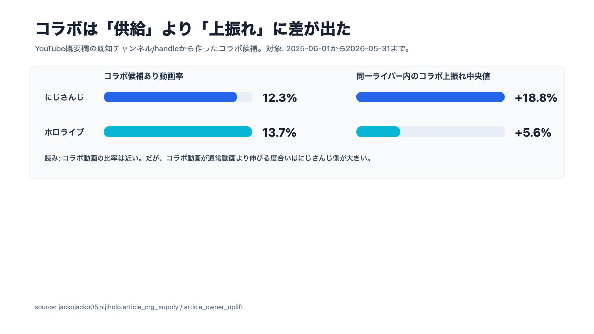
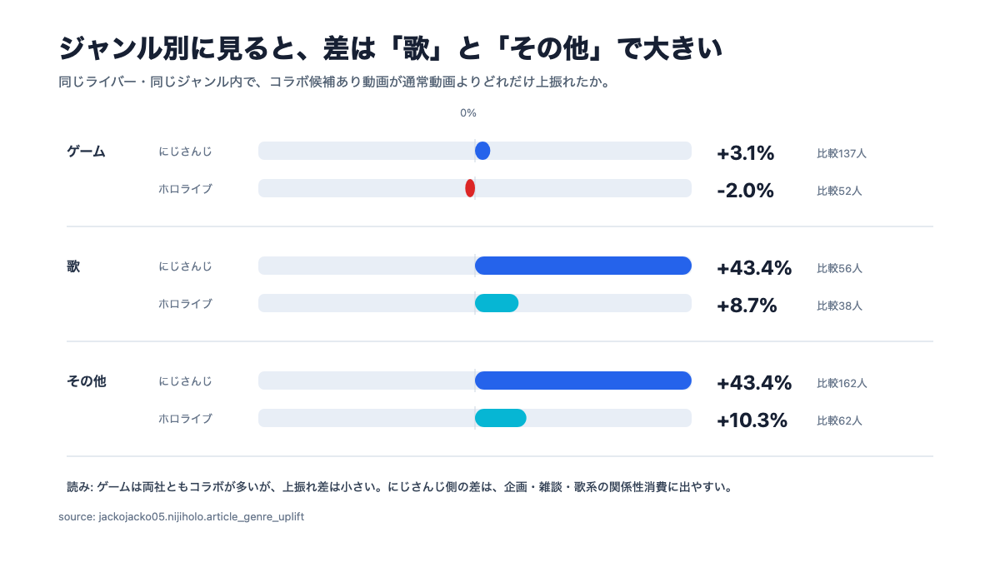
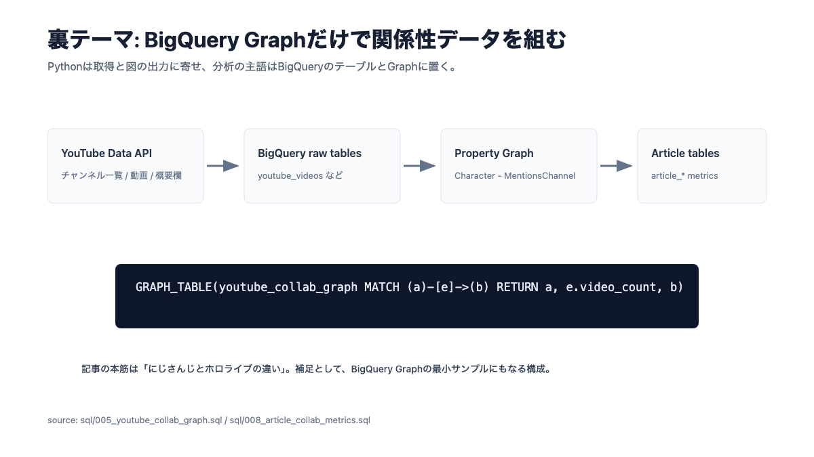
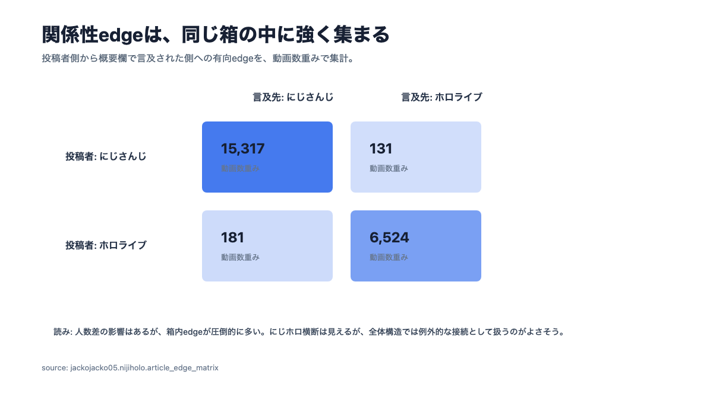

# 「コラボ」のデータから見るにじさんじとホロライブの違い

こんにちは！メガベンチャーでデータアナリストとして働いている、じゃっこと申します。

私は2018年から2019年にかけて、VTuberのディレクターをしていたことがあります。当時はまだ業界全体が今ほど大きくなく、現場ではクリエイターさんや社員さんとかなり近い距離で仕事をしていました。企画動画、歌ってみた、収録、イベント、他社さんとのやりとり。今振り返っても、新卒の頃にあの距離感でVTuberの現場に触れられたのは、かなり貴重な経験だったと思います。

その後、カバーとANYCOLORが上場し、VTuber企業が投資家やビジネスサイドからも語られるようになりました。その頃から「カバーとえにからって何が違うんですか？」と聞かれることが増えました。

私はいつも「全然違います」と答えていました。

ただ、正直に言うと、今まではかなり直感ベースでした。現場で触れた空気感としては明確に違う。でも、その違いをきれいに言語化するのは難しい。にじさんじは箱推しが強く、ホロライブは単推しが強い。にじさんじはプロセカっぽく、ホロライブはアイマスっぽい。そんな比喩では話せるのですが、データで確認したことはありませんでした。

というわけで今回は、その直感を少しだけデータで確認してみます。

テーマは「コラボ」です。

## 先に結論

今回のデータだけで言えることは、だいたい次の3つです。

1つ目。コラボの「供給量」は、にじさんじが一方的に多いわけではありません。2025年6月1日から2026年5月31日までのYouTube動画を見ると、概要欄から検出したコラボ候補あり動画率は、にじさんじが12.3%、ホロライブが13.7%でした。むしろこの定義ではホロライブの方が少し高いです。

2つ目。一方で、コラボ動画が通常動画よりどれだけ伸びるか、つまり「需要の上振れ」は、にじさんじの方が大きく出ました。同一ライバー内で比較したコラボ上振れ中央値は、にじさんじが+18.8%、ホロライブが+5.6%です。

3つ目。この差はゲームよりも、歌やその他の企画・雑談系に出やすいです。ゲームは両社ともコラボが多く、差はそこまで大きくありません。にじさんじらしい差が見えたのは、関係性そのものがコンテンツになりやすい領域でした。



つまり、雑に言うならこうです。

「にじさんじはコラボが多い」というより、「にじさんじはコラボが起きた時に、視聴者側がそれを見に行く理由が強い」。

これが今回の一番大きな発見でした。

## どうやって調べたか

今回は、にじさんじ・ホロライブの現所属ライバーのYouTubeチャンネルを対象に、2025年6月1日から2026年5月31日までに公開された動画を取得しました。

使ったのはYouTube Data APIです。`search.list` は使わず、各チャンネルのuploads playlistから動画IDを取り、`videos.list` でタイトル、概要欄、公開日時、再生数などを取得しています。取得した動画は61,325本、ライバー単位に展開したowner-video行は61,821行です。共有チャンネルや複数ライバーに紐づくチャンネルがあるため、動画数とowner-video行数は少しだけズレます。

コラボ判定は、動画概要欄に既知のチャンネルIDまたは `@handle` が出てくるかで見ました。たとえば、Aさんの動画概要欄にBさんのチャンネルURLが載っていれば、AさんからBさんへの「コラボ候補edge」として扱います。

もちろん、これは完璧なコラボ判定ではありません。概要欄には定型リンク、歌のクレジット、イベント参加者一覧、公式チャンネルなども入ります。そのため、同じ相手が大量に繰り返し出るような定型リンクっぽいedgeはフィルタしています。それでも、これはあくまで「コラボ候補グラフ」です。

ただし、今回見たいのは個別動画の真偽ではなく、箱ごとの傾向です。雑音はありますが、全体の構造を見るには十分使えると判断しました。

## コラボの多さだけでは、にじさんじらしさは説明できない

まず、コラボ候補あり動画率を見ます。

にじさんじは12.3%、ホロライブは13.7%。この数字だけ見ると、「にじさんじの方がコラボが多い」という仮説は支持されません。

ここは、私の直感とも少しズレました。にじさんじはコラボが多い、という印象はかなり強いです。しかし、動画単位で見ると、ホロライブもかなりコラボしています。特にゲームでは、ホロライブのコラボ候補あり動画率は23.5%まで上がります。

つまり、供給量だけを見ると、話はそんなに単純ではありません。

これは考えてみれば当然でもあります。ホロライブも大型企画、ゲーム大会、ユニット活動、3Dライブ、歌ってみた、外部大会など、コラボの供給自体はかなりあります。ホロライブを「ソロだけの箱」と見るのは、さすがに乱暴です。

では、私が感じていた違いはどこにあるのか。

おそらく、コラボの量ではなく、コラボが視聴者にどう消費されるかです。

## 需要を見ると、にじさんじのコラボは上振れしやすい

次に、同一ライバー内で、コラボ候補あり動画が通常動画よりどれだけ伸びたかを見ます。

生の再生数で比べると、チャンネル規模の差が強く出すぎます。そこで今回は、各ライバーの通常の再生水準を基準にして、コラボ候補あり動画がどれだけ上振れたかを見ました。

この指標では、にじさんじの中央値が+18.8%、ホロライブが+5.6%でした。

日次再生で補正しても、にじさんじは+9.3%、ホロライブは-22.0%です。日次補正は公開からの経過日数の影響をならすためのものです。古い動画ほど累積再生数が大きくなるので、その偏りを少し抑えています。

ここでようやく、直感と同じ向きの結果が出ます。

にじさんじは、コラボが起きた時に、そのコラボ自体が見に行く理由になりやすい。単に「推しが出ている」だけではなく、「この組み合わせなら見たい」「この関係性なら何か起きそう」という期待が働きやすい。

もちろん、これは因果ではありません。伸びそうな企画だからコラボする、という逆向きの説明もあります。人気ライバー同士が組みやすい、企画性の高い動画ほど概要欄に参加者が並びやすい、という偏りもあります。

それでも、箱ごとの違いとしてはかなり自然に読めます。

## ジャンル別に見ると、差は「歌」と「その他」で大きい

ジャンルをゲーム、歌、その他に分けました。分類はタイトルのルールベースです。歌枠、歌ってみた、MV、cover、3D liveなどを歌にし、ゲーム名や実況系ワードをゲームにし、それ以外をその他にしています。かなり粗い分類ですが、最初の分解としては十分です。

結果を見ると、ゲームでは差が小さいです。

ゲームのコラボ上振れ中央値は、にじさんじが+3.1%、ホロライブが-2.0%。どちらも大きな差とは言いにくい。ゲームはそもそもコラボしやすいジャンルなので、箱の違いが薄まりやすいのだと思います。

一方で、歌とその他では差が大きくなります。

歌のコラボ上振れ中央値は、にじさんじが+43.4%、ホロライブが+8.7%。その他も、にじさんじが+43.4%、ホロライブが+10.3%でした。



ここがかなり面白いです。

ゲームは、ルールや勝敗や進行がコンテンツを作ってくれます。誰と誰が遊ぶかも大事ですが、ゲームそのものが視聴理由になります。

一方で、歌やその他の企画・雑談系は、組み合わせそのものが視聴理由になりやすい。誰が誰と話すのか。どんな空気になるのか。普段の関係性がどう出るのか。そこに期待が乗る。

にじさんじの強さは、まさにここに出ているように見えます。

## にじさんじはプロセカ、ホロライブはアイマス、という比喩

少し乱暴な比喩をします。

私の感覚では、にじさんじはプロセカっぽく、ホロライブはアイマスっぽいです。

プロセカは、個々のキャラクター人気ももちろんありますが、ユニット、越境、イベントストーリー、関係性の更新がとても強い。あるキャラクターを好きになることと、その周辺の関係性を追うことがかなり近い場所にあります。

一方でアイマスは、もちろんユニットや関係性もありますが、より「担当」という言葉がしっくり来ます。個人のアイドルに対する継続的な愛着、成長、パフォーマンス、プロデュースの感覚が強い。

にじさんじとホロライブの違いも、少しこれに似ている気がします。

にじさんじは、ライバー個人だけでなく、関係性の網そのものがコンテンツになりやすい。誰と誰が並ぶのか、どの企画に誰が来るのか、箱の中で関係がどう更新されるのかを楽しむ文化が強い。

ホロライブは、個々のタレントのブランド、パフォーマンス、チャンネルとしての完成度が強い。もちろん関係性もありますが、視聴者がまず見に行く理由は「その人の動画だから」で成立しやすい。

今回のデータは、この比喩を直接証明するものではありません。ファン心理をアンケートしたわけでも、SNSの発話を分析したわけでもないからです。

ただ、YouTube上のコラボ候補動画の上振れという限られた指標では、この比喩とかなり同じ方向の結果が出ました。

## BigQuery Graphで関係性データとして扱う

今回の裏テーマは、BigQuery Graphのサンプルを作ることでもありました。

動画をただ表で集計するだけではなく、ライバーをnode、概要欄での言及をedgeとして扱います。BigQuery上では、`Character` nodeと `MentionsChannel` edgeからなるproperty graphを作りました。



たとえば、BigQueryでは次のように書けます。

```sql
SELECT *
FROM GRAPH_TABLE(
  `jackojacko05.nijiholo.youtube_collab_graph`
  MATCH (a:Character)-[e:MentionsChannel]->(b:Character)
  RETURN
    a.character_name AS owner_name,
    a.org AS owner_org,
    b.character_name AS collaborator_name,
    b.org AS collaborator_org,
    e.video_count AS video_count,
    e.sample_video_url AS sample_video_url
)
ORDER BY video_count DESC
LIMIT 20;
```

今回のような「誰が誰に言及しているか」「どの箱の中でedgeが濃いか」「横断edgeはどこに出るか」という分析は、グラフとして扱うとかなり見通しが良くなります。

実際、edgeを組織間で集計すると、箱内edgeが圧倒的に大きく出ます。



にじさんじ内の動画数重みは15,317、ホロライブ内は6,524。一方、にじさんじからホロライブは131、ホロライブからにじさんじは181です。

にじホロ横断コラボはもちろん存在します。むしろ最近は、にじホロエアライダー、REPO、麻雀、歌ってみた、外部大会などでかなり見かけるようになりました。ただ、全体構造として見ると、基本は箱内の関係性が強く、横断edgeは局所的に立つ接続として扱うのがよさそうです。

## これは「どちらが上か」ではない

ここまで書いてきたことは、にじさんじが優れているとか、ホロライブが劣っているとか、そういう話ではありません。

むしろ逆です。

ホロライブは、単体で成立する力が強いのだと思います。個々のタレントのチャンネルとしての完成度、ライブ、歌、企画、ブランドの強さ。コラボしなくても視聴理由が立つから、コラボ時の相対上振れが小さく見える可能性があります。

にじさんじは、関係性の更新がコンテンツになりやすい。ライバー個人の魅力に加えて、箱の中の偶然の組み合わせや企画の混ざり方が、視聴理由として強く働きやすい。

この違いは、経営や事業づくりにも関係しているはずです。

ホロライブは、個々のタレントのブランドを強く磨き、グローバルに展開し、ライブや音楽やIPとして積み上げる方向と相性が良い。にじさんじは、多数のライバーが同じ場に存在し、関係性が更新され続けること自体が価値になる。

だから、同じVTuber企業でも、見るべきKPIや伸ばし方はたぶん違います。

ホロライブでは、個々のタレントの継続視聴、ライブ・音楽・グッズ・メンバーシップなど、単体のブランド価値をどう最大化するかが重要になりやすい。

にじさんじでは、ライバー間の接続、企画の組み合わせ、箱内イベント、関係性の更新頻度が、より重要な意味を持ちやすい。

これは、私が当時現場で感じていた「全然違う」の中身にかなり近いです。

## 注意点

最後に、今回の分析の限界も書いておきます。

まず、コラボ判定は概要欄リンク由来です。タイトルに名前が出ているのに概要欄にリンクがない動画は拾えません。逆に、実際には出演していないのに関連リンクとして概要欄に載っているケースは拾ってしまいます。

次に、因果は言えません。コラボしたから伸びたのか、伸びそうな企画だからコラボしたのかは分けられません。

また、ジャンル分類はかなり粗いです。ゲーム、歌、その他の3分類にしていますが、Shorts、3Dライブ、大型企画、案件、切り抜き風動画、告知などは本来もっと分けた方がよいです。

さらに、今回見ているのはYouTube動画だけです。Xのファンアートタグ、pixiv、ニコニコ、TikTok、イベント、グッズ購買などは見ていません。箱推し・単推しを本当に測るなら、SNS投稿や購買行動も必要です。

なので、この記事で言えるのはあくまでこうです。

2025年6月1日から2026年5月31日までのYouTube概要欄データから作ったコラボ候補グラフでは、コラボ供給率は両社で大きく変わらない。一方で、同一ライバー内の相対再生数では、にじさんじのコラボ候補動画の方が上振れしやすい。

## おわりに

昔、現場で働いていた時から、にじさんじとホロライブは全然違うと思っていました。

でも、その違いを説明しようとすると、どうしても「空気感」や「文化」の話になってしまう。もちろん、それはそれで大事です。エンタメの現場は、数字に落ちないものの方が多いです。

ただ、数字に落ちないものを、数字で少しだけ照らすことはできます。

今回見えたのは、にじさんじはコラボが多い、という単純な話ではありませんでした。むしろ、コラボの量だけならホロライブもかなり多い。

違いは、コラボが視聴理由になる強さにありそうです。

にじさんじは、関係性の更新がコンテンツになる。ホロライブは、個々のタレントが単体で強く成立する。

この違いを、私は今後ももう少しちゃんと言語化していきたいです。VTuberというジャンルは、キャラクター、演者、運営、ファン、プラットフォーム、二次創作、ライブ、SNSが全部絡んでいて、本当に面白い。Consumer Generated Mediaの研究をしていた人間としても、元VTuberディレクターとしても、今データアナリストをしている人間としても、まだまだ掘れるところがたくさんあります。

というわけで、今回は「コラボ」のデータから、にじさんじとホロライブの違いを見てみました。

コードと集計SQLはGitHubで公開予定です。BigQuery Graphのサンプルとしても使えるように、Notebookも置いておきます。
